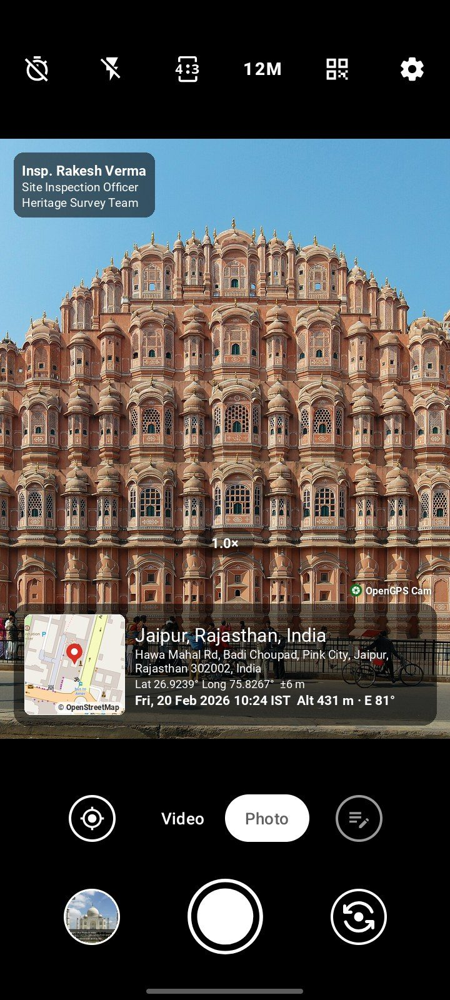
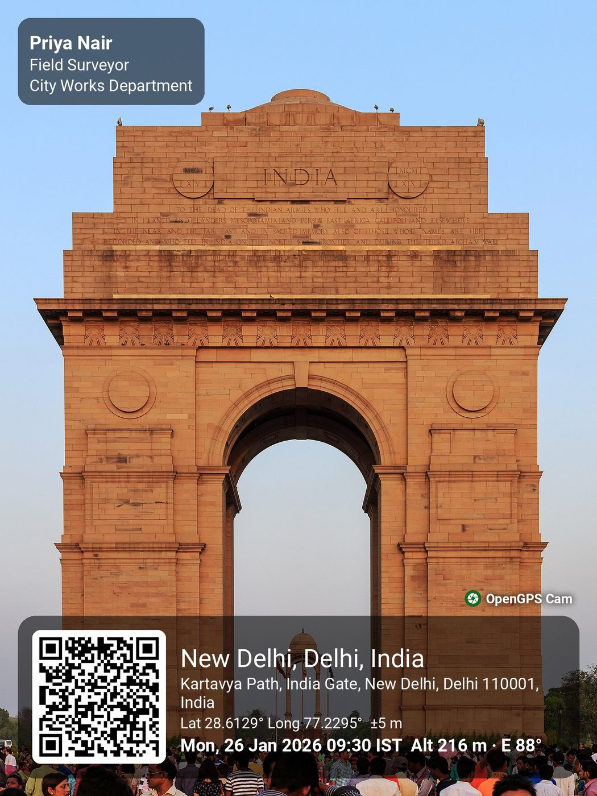
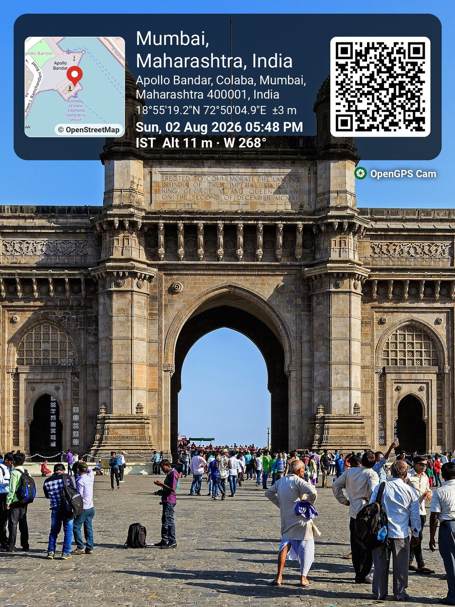
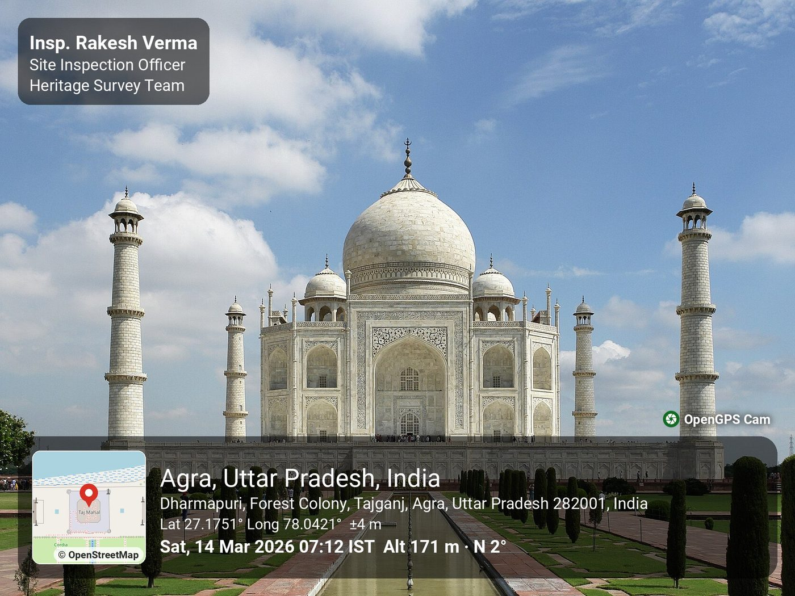

# OpenGPS Cam

[](https://github.com/ratan00/OpenGPSCam/releases/latest)
[](https://github.com/ratan00/OpenGPSCam/releases)

An open-source, *ad-free* Android camera that Overlays a GPS label in live photo: a minimap, the
address, latitude/longitude and the date, time and timezone.
The same is written into the JPEG's EXIF data.

- Live preview of the label over the viewfinder
- More than just location tagging, tag officer name and picture information too.
- Offline-friendly: no address means coordinates only, no map tiles means a simple grid card
- Settings: each field on/off, 12/24-hour time, decimal or DMS coordinates, strip at top or bottom,
  opacity, minimap on/off, and an option to keep an unstamped original too
- No ads, no analytics, no Play Services. Location is read only while the camera is open

## Screenshots

<table>
  <tr>
    <td align="center"></td>
    <td align="center"></td>
    <td align="center"></td>
  </tr>
  <tr>
    <td align="center">Live label in the viewfinder</td>
    <td align="center">QR code to the location</td>
    <td align="center">Strip at top, map + QR, DMS</td>
  </tr>
  <tr>
    <td colspan="3" align="center"></td>
  </tr>
  <tr>
    <td colspan="3" align="center">Saved photo: minimap, address, coordinates, accuracy, time, altitude, heading and officer details</td>
  </tr>
</table>

Names, dates and positions in these samples are made up.

## Network use

The only network access is fetching a handful of OpenStreetMap tiles around your position for the
minimap (identifying User-Agent, on-disk cache, no prefetching, in line with the
[OSM tile usage policy](https://operations.osmfoundation.org/policies/tiles/)). Turn the minimap off
in settings and the app never goes online. Addresses come from the system `Geocoder`.

Map data © [OpenStreetMap contributors](https://www.openstreetmap.org/copyright) (ODbL). The strip
carries the "© OpenStreetMap" credit whenever a real map is shown.

## Building

```
echo "sdk.dir=/path/to/android-sdk" > local.properties   # platforms;android-36, build-tools;36.0.0
./gradlew assembleFossDebug          # app/build/outputs/apk/foss/debug/
./gradlew detekt lintFossDebug testFossDebugUnitTest
```

Camera and GPS need a real phone: `adb install -r <apk>`. See [PLAN.md](PLAN.md) for the design.

## Credits and license

A fork of [Fossify Camera](https://github.com/FossifyOrg/Camera). Licensed under the
[GNU GPL v3.0](LICENSE); upstream history is kept, and the `upstream` remote can be used to merge
future changes.

Sample photos in `docs/images` are edited from Wikimedia Commons originals and keep their licenses:
[Hawa Mahal](https://commons.wikimedia.org/wiki/File:Hawa_Mahal_2011.jpg) by Marcin Białek (CC BY-SA),
[India Gate](https://commons.wikimedia.org/wiki/File:India_Gate_in_New_Delhi_03-2016.jpg) and
[Gateway of India](https://commons.wikimedia.org/wiki/File:Mumbai_03-2016_30_Gateway_of_India.jpg) by A.Savin
([Free Art License](https://artlibre.org/licence/lal/en/)),
[Taj Mahal](https://commons.wikimedia.org/wiki/File:Taj_Mahal_(Edited).jpeg) by Yann, edited by Jim Carter (CC BY-SA).
Map tiles © OpenStreetMap contributors.
